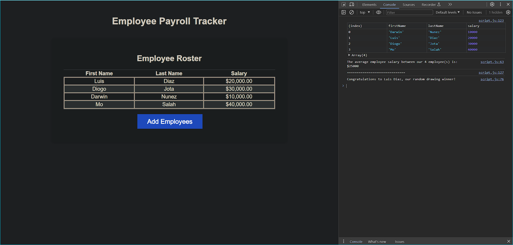

# employee-payroll-tracker

## Description

The Employee Payroll Tracker will allow a payroll manager to easily view and manage employee payroll data and will also provide some useful statistics.

## Installation

N/A

## Usage

The majority of the function of the Employee Pasyroll Tracker is reached via the `Add Employees` button, located under the `Employee Roster` table. Clicking this will trigger a string of prompts for employee information (first name, last name and salary). The user can then choose to add another employee (`OK`) or click `Cancel`, which will write all the gathered employee data to the table in the employee roster. Additional statistical data is then processed and can be found by accessing the console (`F12` on Chrome). Just for fun, a randomly selected employee will be drawn and a congratulatory message is printed to the console.

>Deployment can be found here:
[https://simonjbr.github.io/employee-payroll-tracker/](https://simonjbr.github.io/employee-payroll-tracker/)

Screenshot of deployed webpage:

    

## Credits

Starter code provided by edX.

Code for collectEmployees(), displayAverageSalary() and getRandomEmployee() written by simonjbr.

## License

Please refer to license information in the repository.
